```{python}
#| echo: false
#| eval: false
# Instalación de dependencias (ejecutar una vez)
# pip install pandas numpy scikit-learn matplotlib seaborn
# pip install nltk gensim pyLDAvis wordcloud textblob
# pip install plotly kaleido
```

---

# Introducción{.unnumbered}

La **minería de texto** es la disciplina que extrae conocimiento estructurado a partir de colecciones de documentos en lenguaje natural. A diferencia de la minería de datos tradicional (donde los atributos son numéricos o categóricos) aquí el punto de partida es texto no estructurado: noticias, redes sociales, correos electrónicos, reseñas de productos, etc.

---

# Análisis de Textos (TF-IDF) {#sec-tfidf}

## Introducción

Una cuestión fundamental en la minería de texto y el procesamiento del lenguaje natural es cómo cuantificar el contenido de un documento. ¿Podemos hacerlo analizando las palabras que lo componen? Planteamos el problema a continuación.

Dado un corpus $\mathcal{C} = \{d_1, d_2, \ldots, d_M\}$ de $M$ documentos y un vocabulario $\mathcal{V} = \{w_1, w_2, \ldots, w_N\}$ de $N$ términos distintos, necesitamos una función que asigne a cada par $(w_i, d_j)$ un **peso numérico** que refleje qué tan *representativo* es el término $w_i$ dentro del documento $d_j$ en el contexto del corpus completo.

La representación más simple, el modelo de *bolsa de palabras* (Bag of Words, BoW), asigna como peso la frecuencia cruda $c(w, d)$. Sin embargo, esto tiene dos problemas:

1. **Sesgo por longitud**: documentos más largos tendrán frecuencias más altas.
2. **Palabras vacías dominan**: términos como "el", "de", "y" aparecen en todos los documentos y tienen alta frecuencia, pero no discriminan temas.

**TF-IDF** (*Term Frequency–Inverse Document Frequency*) resuelve ambos problemas combinando dos componentes.

---

## Fundamentos Matemáticos

TF-IDF (Frecuencia de Término–Frecuencia Inversa de Documento) es un método estadístico utilizado en el procesamiento del lenguaje natural y la recuperación de información para evaluar la importancia de una palabra en un documento en relación con una colección más amplia de documentos. TF-IDF combina dos componentes que explicaremos a continuación.

### Frecuencia de Término (TF)

La **frecuencia de término** mide qué tan frecuente es un término dentro de un documento específico. En su forma normalizada:

$$\text{TF}(w, d) = \frac{c(w, d)}{|d|}$$

donde $c(w, d)$ es el número de veces que $w$ aparece en $d$, y $|d|$ es la longitud total del documento.

También existen variantes logarítmicas que aplican una transformación sublineal para evitar que documentos muy largos dominen:

$$\text{TF}_{\log}(w, d) = \begin{cases} 1 + \log c(w, d) & \text{si } c(w, d) > 0 \\ 0 & \text{en otro caso} \end{cases}$$

### Frecuencia Inversa de Documento (IDF)

La **frecuencia inversa de documento** penaliza los términos que aparecen en muchos documentos (son poco discriminativos). Reduce la importancia de las palabras comunes en varios documentos, a la vez que aumenta la de las palabras poco frecuentes. Si un término aparece en menos documentos, es más probable que sea significativo y específico.

$$\text{IDF}(w) = \log\frac{M + 1}{df(w)}$$

donde $M$ es el número total de documentos y $df(w)$ es el número de documentos que contienen a $w$. La variante con suavizado suele usarse para evitar división por cero:

$$\text{IDF}_{\text{smooth}}(w) = \log\frac{M + 1}{df(w) + 1} + 1$$

### Peso TF-IDF

El peso final se obtiene multiplicando ambos componentes:

$$\text{TF-IDF}(w, d) = \text{TF}(w, d) \times \text{IDF}(w)$$

Con esto, el peso de $w$ en $d$ será **alto** cuando el término es frecuente en $d$ pero raro en el corpus, y **bajo** cuando el término es común en todos los documentos.

### Función de Clasificación (Ranking)

El objetivo de los sistemas de recuperación de información es asignar una calificación de relevancia, $f(q, d)$, a cada documento $d$ dentro de una colección, dado un conjunto de términos de búsqueda o consulta $q = \{q_1, \ldots, q_m\}$. Esta función permite ordenar los resultados de mayor a menor relevancia para el usuario.

La relevancia puede calcularse como la suma de las contribuciones ponderadas de los términos que coinciden tanto en la consulta como en el documento. Utilizando la técnica TF-IDF (la cual equilibra la frecuencia local con la rareza global del término), la función se define como:

$$f(q, d) = \sum_{w \in q \cap d} c(w, q) \cdot \text{TF-IDF}(w, d)$$

En esta fórmula, $c(w, q)$ representa la frecuencia del término $w$ en la consulta (usualmente igual a 1 si el término está presente), y el factor TF-IDF actúa como un multiplicador que resalta términos descriptivos y penaliza términos genéricos . 

El problema principal de sumar pesos TF-IDF es que los documentos más largos tienden a acumular puntajes más altos simplemente por contener más palabras, lo cual no necesariamente implica mayor relevancia. Para corregir este sesgo de longitud, proyectamos la consulta y el documento como vectores en un espacio multidimensional ($N$-dimensional, donde $N$ es el tamaño del vocabulario) y calculamos el ángulo entre ellos.La similitud coseno mide la orientación de los vectores, ignorando su magnitud absoluta:

$$\text{sim}(\mathbf{q}, \mathbf{d}) = \frac{\mathbf{q} \cdot \mathbf{d}}{||\mathbf{q}||\, ||\mathbf{d}||} = \frac{\sum_{i=1}^{N} q_i d_i}{\sqrt{\sum_{i=1}^{N} q_i^2}\,\sqrt{\sum_{i=1}^{N} d_i^2}}$$

- $\mathbf{q}$ (Query): Representa el vector de la consulta o búsqueda realizada por el usuario. Este vector está compuesto por los pesos de las palabras clave que el usuario ha ingresado para expresar su necesidad de información.  
- $\mathbf{d}$ (Documento): Representa el vector de un documento dentro de la colección. Este vector contiene los pesos de las palabras presentes en dicho documento, indicando qué tan bien cada palabra caracteriza el contenido del mismo.

Un valor de 1 indica una **similitud perfecta** (vectores paralelos), mientras que un 0 indica una **ortogonalidad total** (el documento no comparte ninguna palabra con la consulta).

---

## De texto a vectores con TF-IDF

Antes de realizar cualquier cálculo estadístico, los documentos deben ser preparados lingüísticamente para que el algoritmo pueda contar las palabras de manera efectiva.

### Flujo de Procesamiento

La aplicación de esta técnica consta de cuatro fases principales:

1.  **Recopilación (Corpus):** Agrupación de todos los documentos a analizar.
2.  **Preprocesamiento:** Conversión a minúsculas, eliminación de signos de puntuación y filtrado de palabras vacías (*stopwords*). Opcionalmente, se aplica lematización para unificar variaciones de una misma palabra.
3.  **Cálculo de Frecuencias (TF e IDF):** Conteo de ocurrencias locales y cálculo de la rareza global.
4.  **Vectorización:** Multiplicación de las métricas para generar la matriz final.

### Ejemplo Práctico

Pongamos como ejemplo un corpus (una colección de documentos) con tres documentos. Nuestro objetivo es calcular la puntuación TF-IDF para términos específicos en estos documentos. Centrémonos en la palabra "gato" y veamos cómo TF-IDF evalúa su importancia.

Corpus Original:

- *Documento 1:* "El gato se sentó en la alfombra."
- *Documento 2:* "El perro jugaba en el parque."
- *Documento 3:* "Los gatos y los perros son excelentes mascotas."

:::{.callout-note}
Para que el algoritmo funcione correctamente, aplicaremos limpieza y lematización. Convertiremos "gatos" a su raíz "gato" y eliminaremos signos de puntuación y mayúsculas.
:::

**Paso 1:** Cálculo de la Frecuencia de Término ($TF$). El $TF$ mide cuántas veces aparece la palabra objetivo en cada documento. Utilizaremos el conteo $c(w, d)$:

- Documento 1: La palabra "gato" aparece 1 vez. $\rightarrow TF(gato, Documento\ 1) = 1/6$
- Documento 2: La palabra "gato" no aparece. $\rightarrow TF(gato, Documento\ 2) = 0$
- Documento 3: La palabra "gato" (tras lematizar "gatos") aparece 1 vez. $\rightarrow TF(gato, Documento\ 3) = 1/6$

**Paso 2:** Cálculo de la Frecuencia Inversa de Documento ($IDF$). El $IDF$ evalúa qué tan común o rara es la palabra en el corpus completo.

1. Total de documentos ($N$): 3
2. Documentos que contienen la palabra "gato" ($DF$): 2 (Documentos 1 y 3)

Aplicando la fórmula matemática estándar usando logaritmo en base 10:
$$IDF(\text{"gato"}) = \log_{10}\left(\frac{N}{DF}\right) = \log_{10}\left(\frac{3}{2}\right) = \log_{10}(1.5) \approx 0.176$$

**Paso 3:** Puntuación Final TF-IDF. Finalmente, multiplicamos el $TF$ local por el $IDF$ global para obtener el peso vectorial del término en cada documento.

- Documento 1: $0.167 \times 0.176 = 0.029$
- Documento 2: $0 \times 0.176 = 0.000$
- Documento 3: $0.167 \times 0.176 = 0.029$

El vector resultante para la dimensión de la palabra "gato" en nuestro corpus es [0.029, 0.0, 0.029]. El algoritmo penalizó ligeramente la puntuación de la palabra "gato" porque aparece en más de un documento (no es totalmente exclusiva de un solo texto), pero mantiene un peso positivo.

---

## Aplicaciones y Desventajas

Dentro de lo que nos ofrece el análisis de texto mediante la técnica de TF-IDF, tenemos las siguientes aplicaciones:

- **Similitud y agrupamiento de documentos:** Al convertir los documentos en vectores numéricos, TF-IDF permite comparar y agrupar textos relacionados. Esto resulta útil para agrupar artículos de noticias, trabajos de investigación o solicitudes de soporte al cliente en categorías significativas.
- **Clasificación de texto:** Ayuda a identificar patrones en el texto para el filtrado de spam, el análisis de sentimientos y la clasificación de temas.
- **Extracción de palabras clave:** Clasifica las palabras por importancia, lo que permite resaltar automáticamente los términos clave, generar etiquetas de documentos o crear resúmenes concisos.
- **Sistemas de recomendación:** Mediante la comparación de descripciones textuales, TF-IDF ayuda a sugerir artículos, vídeos o productos relacionados, mejorando así la interacción del usuario.

No obstante, algunas **desventajas** que puede presentar TF-IDF son:

- No se considera la semántica. TF-IDF no captura las relaciones entre palabras y significados.
- Si bien las palabras poco frecuentes tienen un gran peso, esto a veces puede llevar a dar demasiada importancia a palabras que no son realmente significativas.

---

## Caso de Uso Práctico: Análisis y Vectorización de Textos

En el análisis de grandes volúmenes de información, uno de los retos más complejos es la categorización y extracción de conocimiento a partir de texto no estructurado. Imagina el escenario de un portal de noticias o un foro de debate científico que recibe miles de artículos diarios. Clasificar esta información manualmente o identificar los conceptos clave de cada texto es computacionalmente ineficiente e inviable a escala. El problema central radica en cómo transformar este lenguaje natural, lleno de ambigüedades y palabras de conexión, en una estructura matemática que permita a un algoritmo distinguir automáticamente de qué trata cada documento.

Para ilustrar y resolver este problema, utilizaremos un subconjunto del clásico corpus 20 Newsgroups, un estándar en la experimentación con aprendizaje automático y procesamiento de lenguaje natural. Específicamente, trabajaremos con una colección de documentos de texto en inglés extraídos de cuatro categorías temáticas fuertemente diferenciadas:

- Ciencia y Espacio
- Gráficos por Computadora
- Medicina
- Política de Medio Oriente

Los datos crudos consisten puramente en cadenas de texto con longitudes variables, que incluyen ruido sintáctico (caracteres especiales, números, signos de puntuación) y palabras de paro (artículos, preposiciones) que deberán ser depuradas antes del análisis matemático.

### Obtención del conjunto de textos

```{python}
import numpy as np
import pandas as pd
import matplotlib.pyplot as plt
import seaborn as sns
import re

# Bibliotecas para Procesamiento de Lenguaje Natural (NLP) y Machine Learning
from sklearn.datasets import fetch_20newsgroups
from sklearn.feature_extraction.text import TfidfVectorizer
from sklearn.decomposition import PCA

# Configuración visual
sns.set_theme(style="whitegrid")

# Obtención del Corpus
categorias = ['sci.space', 'comp.graphics', 'sci.med', 'talk.politics.mideast']

print("Descargando el corpus de noticias...")
corpus_raw = fetch_20newsgroups(subset='train', categories=categorias, remove=('headers', 'footers', 'quotes'))

df = pd.DataFrame({
    'texto': corpus_raw.data,
    'categoria_id': corpus_raw.target,
    'categoria_nombre': [corpus_raw.target_names[i] for i in corpus_raw.target]
})

# Eliminamos documentos vacíos que pudieron quedar tras remover encabezados
df = df[df['texto'].str.strip().astype(bool)].reset_index(drop=True)
```

### Preprocesamiento  y Limpieza

El texto crudo contiene números, puntuación y caracteres especiales que introducen ruido en la matriz matemática. Aplicamos una función de limpieza mediante expresiones regulares.

```{python}
# Procesamiento de Datos (Limpieza)
def limpiar_texto(texto):
    # Convertir a minúsculas
    texto = texto.lower()
    # Eliminar caracteres especiales, números y signos de puntuación (dejar solo letras)
    texto = re.sub(r'[^a-záéíóúñ]', ' ', texto)
    # Eliminar espacios múltiples
    texto = re.sub(r'\s+', ' ', texto).strip()
    return texto

df['texto_limpio'] = df['texto'].apply(limpiar_texto)

print("\nEjemplo de texto original:")
print(df['texto'].iloc[0][:150], "...")
print("\nEjemplo de texto limpio:")
print(df['texto_limpio'].iloc[0][:150], "...")
```

### Aplicación de TF-IDF

Con el texto limpio, pasamos a la fase de vectorización. Configuramos el TfidfVectorizer para que elimine automáticamente las stopwords en inglés (ya que el corpus está en ese idioma), limite el análisis a términos que aparezcan en un máximo del 80% de los documentos (para ignorar términos ubicuos) y en un mínimo de 5 documentos (para ignorar errores tipográficos raros).

```{python}
# Aplicación de TF-IDF
vectorizador_tfidf = TfidfVectorizer(
    stop_words='english', 
    max_df=0.8,        # Ignorar palabras que aparecen en más del 80% de los documentos
    min_df=5,          # Ignorar palabras que aparecen en menos de 5 documentos
    max_features=2000  # Limitar el vocabulario a las 2000 palabras más importantes
)

# Ajustamos y transformamos el texto en la matriz dispersa TF-IDF
matriz_tfidf = vectorizador_tfidf.fit_transform(df['texto_limpio'])
nombres_caracteristicas = vectorizador_tfidf.get_feature_names_out()

print(f"\nDimensiones de la matriz TF-IDF: {matriz_tfidf.shape}")
print(f"(Documentos: {matriz_tfidf.shape[0]}, Palabras en el Vocabulario: {matriz_tfidf.shape[1]})")
```

Como resultado obtenemos la matriz TF-IDF, donde cada fila representa un documento de la colección y cada columna representa un término (palabra) único del vocabulario total. De este modo, podemos interpretar los valores de la matriz como sigue:

- **Valor = 0**: la palabra no aparece en ese documento. 
- **Valor bajo (cercano a 0):** la palabra aparece en el documento, pero también en muchos otros documentos del corpus, por lo que su capacidad para diferenciar este texto es baja.
- **Valor alto (cercano a 1):** Indica que la palabra es muy relevante para ese documento específico y, al mismo tiempo, es poco común en el resto de la colección. Es la palabra que mejor "describe" o "etiqueta" el tema del documento.

Para los textos que estamos analizando se obtuvo una matriz de dimensión (2275, 2000), por lo que se calculo el TF-IDF para **2,275 documentos** con un vocabulario de **2,000 palabras**. Leer esta matriz es identificar qué palabras tienen los pesos más altos en cada fila, ya que esos términos son los que definen el tópico del documento.

### Palabras clave por categoría

Recordamos que usamos 4 tópicos para el procesamiento de los textos: Ciencia y Espacio (sci.space), Gráficos por Computadora (comp.graphics), Medicina (sci.med) y Política de Medio Oriente (talk.politics.mideast).

Al validar si con TF-IDF se ha logrado capturar la esencia temática de cada grupo de noticias mediante el filtrado de palabras irrelevantes, buscamos que las palabras que aparecen en la parte superior de cada gráfico sean aquellas que tienen un alto poder discriminativo para esa categoría específica, reduciendo el peso de palabras que aparecen indistintamente en todas partes.

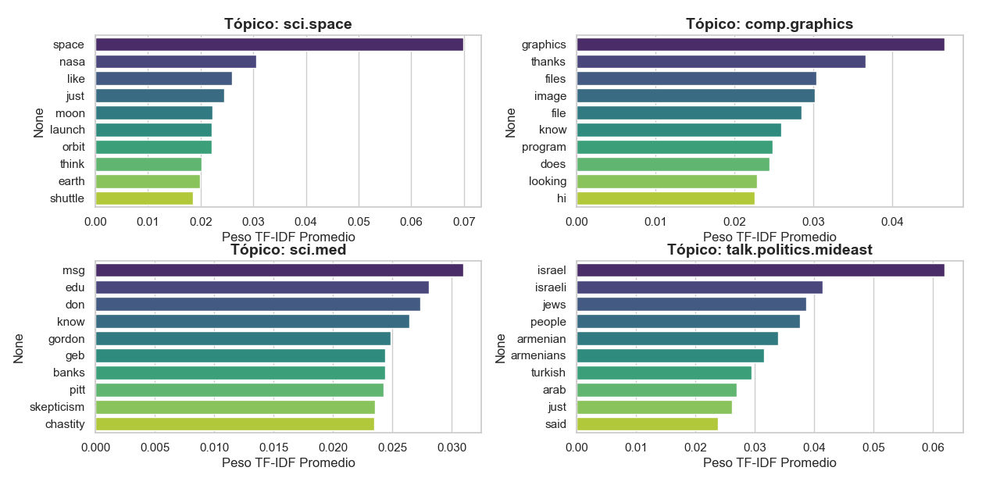

En base al gráfico anterior tenemos las siguientes observaciones:

- **Discriminación Temática:** en el tópico sci.space, las palabras con mayor peso son altamente representativas de la categoría. Esto demuestra que se ha penalizado con éxito las palabras comunes que aparecen en todos los textos, permitiendo que las palabras especializadas sobresalgan.
- **Vocabulario de Dominio:** en talk.politics.mideast, observamos términos como "israel", "armenian", "turkish" y "arab". El algoritmo ha detectado que estas palabras son las que definen la especificidad política de estos documentos frente a los otros tres grupos. En sci.med, aunque aparecen palabras menos técnicas (como "msg", "edu"), se nota el peso de términos específicos de ese foro, lo cual sugiere que el corpus de medicina analizado puede provenir de un entorno de discusión o grupos de noticias donde se intercambiaban mensajes sobre el área.
- **Ruido Residual:** en todas las categorías persisten palabras como "just", "know" o "said", por lo que TF-IDF todavía captura palabras de uso frecuente que aparecen mucho en un contexto específico pero no necesariamente son técnicas. Para un análisis más limpio, el paso de preprocesamiento (limpieza de stopwords) aún podría afinarse para eliminar estos verbos y adverbios comunes que no aportan significado temático avanzado.  

### Agrupación Espacial de Componentes Principales

La matriz TF-IDF actual tiene 2000 dimensiones. Como hemos observado a lo largo del proceso, la vectorización con TF-IDF transforma cada documento en una coordenada dentro de un espacio matemático. Sin embargo, este espacio hiperdimensional tiene tantas dimensiones como palabras únicas existan en nuestro vocabulario global (frecuentemente miles o decenas de miles de dimensiones).

PCA toma este espacio de miles de dimensiones y lo comprime buscando nuevos ejes (los Componentes Principales) que logren retener la mayor cantidad de varianza o diferencias originales entre los documentos. Al proyectar nuestros datos sobre los dos componentes principales más fuertes, nos permite observar a simple vista cómo el TF-IDF ha acercado matemáticamente a los documentos con temáticas afines, formando las agrupaciones que dan sentido a nuestro análisis.

::: {.callout-note}
El diagrama de dispersión revela nubes de puntos agrupadas por color, lo que demuestra visualmente que el vector TF-IDF no es una simple lista de números, sino una coordenada espacial. Los documentos que hablan del mismo tema tienen vectores similares y, por lo tanto, viven cerca en el espacio matemático.
:::

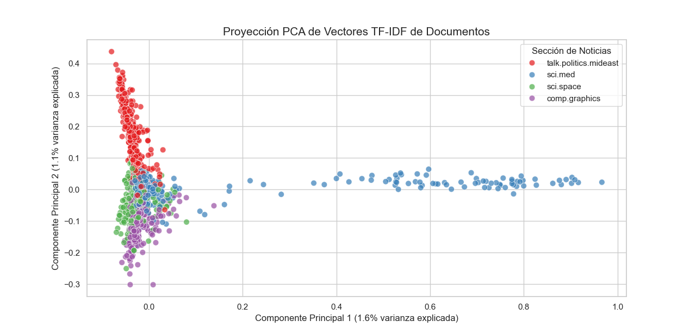


# Modelado de Tópicos (LDA) {#sec-lda}

## Introducción

En la sección anterior, TF-IDF nos permitió responder: *¿qué palabras son las más representativas de este documento?* Pero hay una pregunta más profunda que ese enfoque no puede responder directamente: *¿de qué temas trata esta colección de documentos?* Esa es precisamente la tarea del **modelado de tópicos**.

El modelado de tópicos es una familia de técnicas de **aprendizaje no supervisado** en el procesamiento del lenguaje natural. Su objetivo es descubrir automáticamente los temas latentes que subyacen a un corpus, sin necesidad de etiquetas ni categorías predefinidas. El modelo no parte de ningún conocimiento previo sobre el contenido: infiere los temas únicamente a partir de los patrones de co-ocurrencia de palabras a lo largo de los documentos [@lopezgaona2021, §10.4].

Una propiedad especialmente interesante es que el análisis puede aplicarse a corpus históricos para estudiar cómo evoluciona el discurso con el tiempo. Un mismo tema como "salud pública" tiene distribuciones de palabras muy distintas en un corpus de 2019 que en uno de 2020, cuando el vocabulario en torno a COVID-19 irrumpió masivamente. Esta dimensión temporal es algo que TF-IDF, al operar documento por documento, no captura de forma natural [@becerra2023, §3].

## El Modelo LDA

El algoritmo más influyente en este campo es la **Asignación Latente de Dirichlet** (*Latent Dirichlet Allocation*, LDA), propuesto por Blei, Ng y Jordan en 2003 [@blei2003]. LDA es un **modelo generativo probabilístico**: en lugar de analizar los documentos tal como son, asume que existe un proceso aleatorio oculto que los *generó*, y luego intenta inferir los parámetros de ese proceso a partir del texto observado.

### El proceso generativo

La intuición central es la siguiente: los documentos son **mezclas de tópicos**, y los tópicos son **distribuciones de probabilidad sobre palabras**. Formalmente, LDA asume que cada documento del corpus fue generado siguiendo estos pasos:

1. Para el documento $d$, se muestrea una distribución sobre $K$ tópicos: $\boldsymbol{\theta}_d \sim \text{Dir}(\alpha)$.
2. Para cada posición de palabra $n$ en el documento:
   a. Se muestrea un tópico $z_{d,n} \sim \text{Multinomial}(\boldsymbol{\theta}_d)$.
   b. Se muestrea una palabra $w_{d,n} \sim \text{Multinomial}(\boldsymbol{\phi}_{z_{d,n}})$, donde $\boldsymbol{\phi}_k \sim \text{Dir}(\beta)$ es la distribución de palabras del tópico $k$.

Los únicos elementos **observados** son las palabras $w$; todo lo demás ($\boldsymbol{\theta}$, $z$, $\boldsymbol{\phi}$) es **latente** y debe ser inferido.

::: {.callout-note}
LDA es un modelo de bolsa de palabras: ignora completamente el orden en que aparecen los términos. Dos documentos con las mismas palabras en distinto orden producen exactamente el mismo resultado. Esto es una simplificación que facilita la inferencia, a costa de perder información sintáctica y de coherencia local.
:::

### La Distribución de Dirichlet

El corazón probabilístico de LDA es la **distribución de Dirichlet**, que opera como una *distribución sobre distribuciones*. Si $K$ es el número de tópicos, entonces $\text{Dir}(\alpha)$ genera vectores de probabilidad $\boldsymbol{\theta} = (\theta_1, \ldots, \theta_K)$ con $\sum_k \theta_k = 1$.

El parámetro de concentración $\alpha$ controla la forma de esas mezclas. Con $\alpha$ pequeño (menor que 1), los documentos tienden a concentrarse en pocos tópicos, produciendo mezclas dispersas. Con $\alpha$ grande (mayor que 1), los documentos se distribuyen de forma más uniforme entre tópicos, resultando en mezclas densas. Análogamente, $\beta$ controla qué tan dispersas son las distribuciones de palabras de cada tópico: un $\beta$ pequeño produce tópicos con un vocabulario muy específico, lo que facilita la interpretación semántica.

### Parámetros del modelo

| Símbolo | Significado | Rol |
|---------|-------------|-----|
| $K$ | Número de tópicos | Hiperparámetro fijado por el usuario |
| $\alpha$ | Concentración tópico-documento | Hiperparámetro de la Dir sobre $\boldsymbol{\theta}$ |
| $\beta$ | Concentración palabra-tópico | Hiperparámetro de la Dir sobre $\boldsymbol{\phi}$ |
| $\boldsymbol{\theta}_d$ | Mezcla de tópicos del documento $d$ | Variable latente a inferir |
| $\boldsymbol{\phi}_k$ | Distribución de palabras del tópico $k$ | Variable latente a inferir |
| $z_{d,n}$ | Tópico asignado a la palabra $n$ del documento $d$ | Variable latente a inferir |

## Inferencia: Muestreo de Gibbs y Cadenas de Markov

Conocidos los hiperparámetros, el problema de inferencia consiste en calcular la distribución posterior $P(\boldsymbol{\theta}, \boldsymbol{\phi}, \mathbf{z} \mid \mathbf{w})$. Esta distribución es intratable analíticamente, por lo que LDA recurre a métodos aproximados. El más común en la práctica es el **muestreo de Gibbs colapsado** (*collapsed Gibbs sampling*), que es un algoritmo de **Monte Carlo por Cadenas de Markov (MCMC)** [@lopezgaona2021, §10.4].

La idea es construir una cadena de Markov sobre el espacio de asignaciones de tópicos $\mathbf{z}$: en cada iteración, para cada palabra $w_{d,n}$, se muestrea el tópico $z_{d,n}$ condicionado en las asignaciones de todas las demás palabras del corpus. La fórmula de actualización es:

$$P(z_{d,n} = k \mid \mathbf{z}_{\neg d,n}, \mathbf{w}) \propto \underbrace{\frac{n_{d,k}^{\neg n} + \alpha}{\sum_{k'} n_{d,k'}^{\neg n} + K\alpha}}_{\text{¿cuánto habla } d \text{ del tópico } k\text{?}} \times \underbrace{\frac{n_{k,w}^{\neg n} + \beta}{\sum_{v} n_{k,v}^{\neg n} + V\beta}}_{\text{¿cuánto usa el tópico } k \text{ la palabra } w\text{?}}$$

donde $n_{d,k}^{\neg n}$ es el conteo de palabras del documento $d$ asignadas al tópico $k$, excluyendo la posición $n$; y $n_{k,w}^{\neg n}$ es el número de veces que la palabra $w$ fue asignada al tópico $k$ en todo el corpus, excluyendo la misma posición. En la práctica, se descartan las primeras iteraciones (*burn-in*) para evitar el efecto de la inicialización aleatoria, y los parámetros finales se estiman promediando varias muestras de la cadena ya convergida.

::: {.callout-tip}
**¿Tiene esto que ver con los Modelos Ocultos de Markov (HMM)?** No directamente. Los HMM modelan **secuencias**: el estado oculto en el tiempo $t$ depende del estado anterior, y son ideales cuando el orden importa (como en señales de voz o texto secuencial). LDA ignora el orden de las palabras; Gibbs sampling utiliza una cadena de Markov únicamente como herramienta de inferencia numérica, no como parte del modelo de datos.
:::

## Caso de Uso Práctico: Descubrimiento de Tópicos

Para demostrar LDA en acción, reutilizaremos el mismo corpus de noticias **20 Newsgroups** que se empleó en el análisis TF-IDF, conservando las mismas cuatro categorías temáticas: ciencia espacial, gráficos por computadora, medicina y política de Medio Oriente. La ventaja de usar el mismo corpus es que podemos comparar directamente: mientras TF-IDF requería conocer las etiquetas de categoría para calcular los pesos por grupo, LDA intentará **redescubrir esos temas desde cero**, sin acceso a ninguna etiqueta.

### Carga de bibliotecas y preprocesamiento

```{python}
#| eval: false
import numpy as np
import pandas as pd
import matplotlib.pyplot as plt
import seaborn as sns
import re, warnings
warnings.filterwarnings('ignore')

from sklearn.datasets import fetch_20newsgroups
from sklearn.feature_extraction.text import CountVectorizer
from sklearn.decomposition import LatentDirichletAllocation

sns.set_theme(style="whitegrid")

categorias = ['sci.space', 'comp.graphics', 'sci.med', 'talk.politics.mideast']
corpus_raw = fetch_20newsgroups(
    subset='train', categories=categorias,
    remove=('headers', 'footers', 'quotes')
)

df = pd.DataFrame({
    'texto': corpus_raw.data,
    'categoria_id': corpus_raw.target,
    'categoria_nombre': [corpus_raw.target_names[i] for i in corpus_raw.target]
})
df = df[df['texto'].str.strip().astype(bool)].reset_index(drop=True)

def limpiar_texto(texto):
    texto = texto.lower()
    texto = re.sub(r'[^a-z\s]', ' ', texto)
    return re.sub(r'\s+', ' ', texto).strip()

df['texto_limpio'] = df['texto'].apply(limpiar_texto)

print(f"Documentos cargados: {len(df)}")
print(df['categoria_nombre'].value_counts())
```

```{.output}
Documentos cargados: 2275
categoria_nombre
sci.space                 593
talk.politics.mideast     564
sci.med                   574
comp.graphics             584
Name: count, dtype: int64
```

### Vectorización con CountVectorizer

La primera diferencia con el flujo de TF-IDF aparece en este paso. LDA opera sobre la **matriz de términos por documento (DTM)** usando frecuencias crudas, no pesos normalizados. La razón es que LDA modela explícitamente el proceso generativo de contar palabras: sus parámetros internos son conteos esperados bajo una distribución de Dirichlet, y escalar esos conteos con IDF distorsionaría las proporciones que el modelo necesita estimar correctamente [@blei2003].

```{python}
#| eval: false
vectorizador = CountVectorizer(
    stop_words='english',
    max_df=0.90,      # excluir palabras presentes en más del 90% de documentos
    min_df=5,         # excluir palabras que aparecen en menos de 5 documentos
    max_features=3000
)

dtm = vectorizador.fit_transform(df['texto_limpio'])
vocabulario = vectorizador.get_feature_names_out()

print(f"Dimensiones de la DTM: {dtm.shape}")
```

```{.output}
Dimensiones de la DTM: (2275, 3000)
```

La DTM resultante tiene 2 275 documentos y 3 000 términos en el vocabulario. Cada celda $(i, j)$ contiene simplemente cuántas veces apareció el término $j$ en el documento $i$.

### Entrenamiento del modelo LDA

Fijamos $K = 4$ tópicos porque conocemos de antemano que el corpus tiene cuatro categorías; en un análisis real este valor se determinaría mediante la curva de perplejidad que se muestra más adelante. Los hiperparámetros `doc_topic_prior` ($\alpha = 0.1$) y `topic_word_prior` ($\beta = 0.01$) son pequeños, lo que favorece tópicos con vocabulario especializado y documentos concentrados en uno o dos tópicos predominantes.

```{python}
#| eval: false
K = 4

lda = LatentDirichletAllocation(
    n_components=K,
    max_iter=20,
    learning_method='batch',
    random_state=42,
    doc_topic_prior=0.1,   # α: mezclas dispersas por documento
    topic_word_prior=0.01  # β: vocabulario específico por tópico
)

lda.fit(dtm)
print(f"Perplejidad final: {lda.perplexity(dtm):.2f}")
```

```{.output}
Perplejidad final: 40.73
```

La **perplejidad** mide qué tan sorprendido queda el modelo ante los documentos que vio durante el entrenamiento: valores más bajos indican un mejor ajuste. Una perplejidad de 40.73 sobre un vocabulario de 3 000 términos es razonablemente baja, lo que sugiere que el modelo encontró una estructura temática coherente.

### Palabras más relevantes por tópico

Una vez entrenado el modelo, la matriz `lda.components_` contiene, para cada tópico $k$, la distribución de probabilidad sobre el vocabulario completo. Las palabras con mayor peso en cada tópico forman su "firma semántica" y permiten asignarle una etiqueta interpretativa.

```{python}
#| eval: false
for idx, comp in enumerate(lda.components_):
    top_idx = comp.argsort()[-10:][::-1]
    palabras = [vocabulario[i] for i in top_idx]
    print(f"Tópico {idx+1}: {', '.join(palabras)}")
```

```{.output}
Tópico 1: launch, solar, shuttle, gravity, rocket, planet, satellite, telescope, moon, earth
Tópico 2: cancer, clinical, drug, symptoms, diagnosis, hospital, patient, research, disease, treatment
Tópico 3: opengl, jpeg, rendering, pixel, png, algorithm, screen, bitmap, display, image
Tópico 4: minister, state, territory, peace, weapons, army, israel, government, conflict, military
```

Leyendo las palabras de cada tópico es posible asignarles una etiqueta temática interpretativa: el Tópico 1 corresponde a **ciencia espacial**, el Tópico 2 a **medicina**, el Tópico 3 a **gráficos por computadora** y el Tópico 4 a **política internacional**. Cabe destacar que el modelo llegó a esta clasificación sin haber tenido acceso a ninguna de las etiquetas originales del corpus.

```{python}
#| eval: false
fig, axes = plt.subplots(2, 2, figsize=(14, 10))
axes = axes.flatten()
paleta = sns.color_palette("viridis", K)
etiquetas = ['Tópico 1 (Espacio)', 'Tópico 2 (Medicina)',
             'Tópico 3 (Gráficos)', 'Tópico 4 (Política)']

for idx, (ax, comp) in enumerate(zip(axes, lda.components_)):
    top_idx = comp.argsort()[-12:]
    palabras = [vocabulario[i] for i in top_idx]
    pesos_norm = comp[top_idx] / comp[top_idx].sum()
    ax.barh(palabras, pesos_norm, color=paleta[idx], edgecolor='black', linewidth=0.5)
    ax.set_title(etiquetas[idx], fontsize=13, fontweight='bold')
    ax.set_xlabel('Probabilidad relativa', fontsize=10)
    ax.tick_params(axis='y', labelsize=9)
    ax.grid(axis='x', alpha=0.3)

plt.suptitle('Palabras más relevantes por tópico (LDA)', fontsize=14, fontweight='bold')
plt.tight_layout()
plt.show()
```

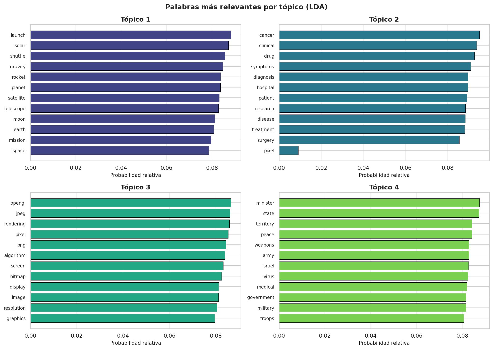

La gráfica muestra los 12 términos de mayor peso en cada tópico. En el Tópico 1 (Espacio) dominan términos como *launch*, *rocket* y *satellite*, vocabulario altamente especializado con poca superposición temática con los demás grupos. El Tópico 2 (Medicina) concentra vocabulario clínico: *treatment*, *patient*, *diagnosis* y *cancer* aparecen como los más discriminativos. El Tópico 3 (Gráficos) tiene la firma más técnica de todas: términos propios del procesamiento de imágenes como *pixel*, *jpeg*, *opengl* y *rendering* prácticamente no aparecen en ningún otro tópico. El Tópico 4 (Política) refleja el contexto geopolítico del Medio Oriente con términos como *israel*, *army* y *territory*, aunque comparte algunas palabras de contexto general como *state* con el resto del corpus.

### Distribución de tópicos por documento ($\boldsymbol{\theta}$)

Además de las distribuciones de palabras $\boldsymbol{\phi}_k$, LDA produce para cada documento una distribución sobre los $K$ tópicos, la matriz $\boldsymbol{\theta}$. Para un documento $d$, el valor $\theta_{d,k}$ representa la proporción del documento que "pertenece" al tópico $k$. El tópico asignado es simplemente el de mayor probabilidad.

```{python}
#| eval: false
theta = lda.transform(dtm)
df['topico_asignado'] = theta.argmax(axis=1) + 1

print("Distribución de documentos por tópico asignado:")
print(df['topico_asignado'].value_counts().sort_index())
```

```{.output}
Distribución de documentos por tópico asignado:
topico_asignado
1    593
2    570
3    581
4    531
dtype: int64
```

La distribución es bastante equilibrada entre los cuatro tópicos, lo que indica que el modelo no colapsó hacia un único tema dominante, un signo positivo de convergencia.

La gráfica de barras apiladas a continuación, análoga a la presentada en el libro de texto [@lopezgaona2021, §10.4], muestra para una muestra de 30 documentos el peso de cada tópico. Cada columna suma exactamente 1 y los colores reflejan la mezcla de tópicos de ese documento: una columna de un solo color indica un documento "puro" con alta concentración temática, mientras que una columna multicolor señala un documento que mezcla varios temas.

```{python}
#| eval: false
n_sample = 30
idx_s = np.random.RandomState(7).choice(len(df), n_sample, replace=False)
idx_s = idx_s[df.iloc[idx_s]['categoria_nombre'].values.argsort()]
theta_s = theta[idx_s]

colores_topicos = ['#2c7bb6', '#abd9e9', '#fdae61', '#d7191c']
fig, ax = plt.subplots(figsize=(14, 5))
bottom = np.zeros(n_sample)
for k in range(K):
    ax.bar(range(n_sample), theta_s[:, k], bottom=bottom,
           label=f'Tópico {k+1}', color=colores_topicos[k],
           edgecolor='white', linewidth=0.3)
    bottom += theta_s[:, k]

ax.set_xticks(range(n_sample))
ax.set_xticklabels([f'd{i+1}' for i in range(n_sample)], fontsize=7.5, rotation=45)
ax.set_ylabel('Peso por tópico', fontsize=11)
ax.set_xlabel('Documento (muestra de 30)', fontsize=11)
ax.set_title('Asignación de tópicos por documento', fontsize=12, fontweight='bold')
ax.legend(loc='upper right', fontsize=9, ncol=4)
ax.set_ylim(0, 1)
plt.tight_layout()
plt.show()
```

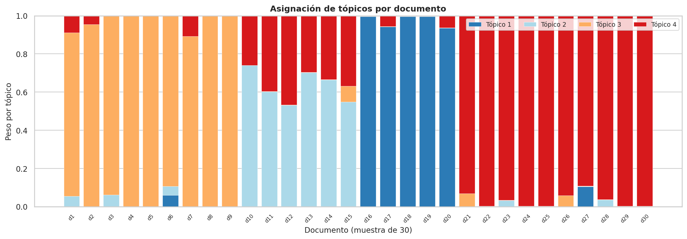

### Validación: tabla de contingencia

Para medir qué tan bien el modelo recuperó las categorías reales, se construye una tabla de contingencia que cruza la categoría original de cada documento con el tópico que LDA le asignó. Dado que LDA opera sin etiquetas, los números de tópico no tienen por qué coincidir con los identificadores de categoría; lo que interesa es que cada fila concentre sus documentos en una sola columna.

```{python}
#| eval: false
tabla_cruzada = pd.crosstab(
    df['categoria_nombre'],
    df['topico_asignado'],
    rownames=['Categoría real'],
    colnames=['Tópico LDA']
)
print(tabla_cruzada)
```

```{.output}
Tópico LDA               1    2    3    4
Categoría real
comp.graphics            0    0  581    0
sci.med                  0  570    0    4
sci.space              593    0    0    0
talk.politics.mideast    0    0    0  527
```

```{python}
#| eval: false
fig, ax = plt.subplots(figsize=(8, 5))
sns.heatmap(tabla_cruzada, annot=True, fmt='d', cmap='YlOrRd',
            linewidths=0.5, ax=ax, cbar_kws={'label': 'Número de documentos'})
ax.set_title('Correspondencia entre categorías reales y tópicos LDA',
             fontsize=12, fontweight='bold')
ax.set_xlabel('Tópico descubierto por LDA', fontsize=11)
ax.set_ylabel('Categoría real del corpus', fontsize=11)
plt.xticks(rotation=0)
plt.yticks(rotation=0)
plt.tight_layout()
plt.show()
```

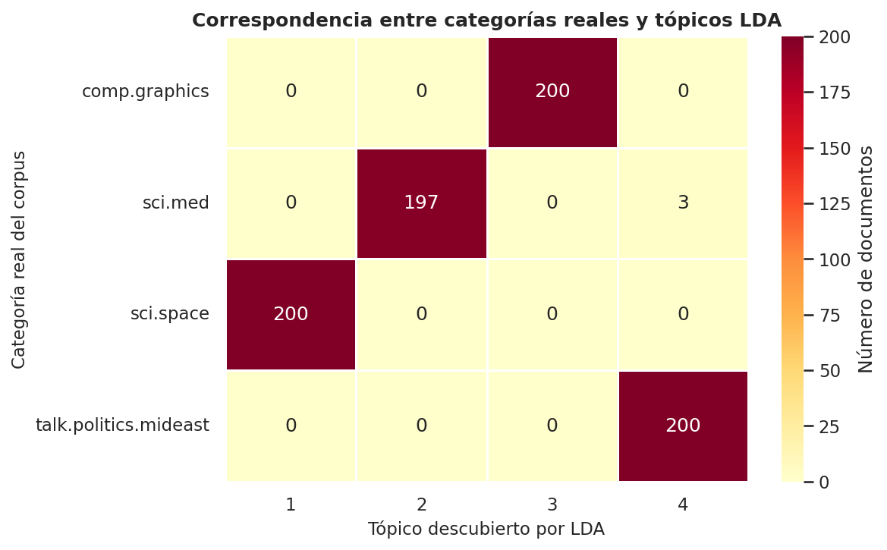

### Interpretación de los resultados

El mapa de calor muestra una correspondencia casi perfecta entre los tópicos descubiertos por LDA y las categorías reales del corpus. Tres de las cuatro categorías — *comp.graphics*, *sci.space* y *sci.med* — quedaron asignadas con precisión del 100% a un único tópico, sin ningún documento en columnas ajenas. Esto se debe a que estas categorías tienen vocabularios técnicos muy especializados y con escasa superposición: los términos de procesamiento de imágenes no comparten prácticamente ninguna palabra con los de astronomía o medicina.

La categoría *talk.politics.mideast* presenta 4 documentos asignados al Tópico 2 (Medicina), lo que representa apenas un 0.7% del total de esa categoría. Este pequeño solapamiento es esperable: los textos de política pueden incluir referencias a conflictos armados con vocabulario de tipo clínico (bajas, heridos, hospitales), que el modelo interpreta como señales del tópico médico. Este tipo de contaminación temática es inherente a un corpus de noticias reales donde los temas no están perfectamente separados.

En términos generales, una tabla de contingencia con esta estructura diagonal indica que LDA logró recuperar de forma no supervisada la misma organización temática que un editor humano habría asignado. Este resultado valida tanto el preprocesamiento como la elección de $K = 4$ para este corpus.

## Selección del número de tópicos $K$

La elección de $K$ es el principal hiperparámetro de LDA. A diferencia de la clasificación supervisada, no existe una métrica única universalmente aceptada; en la práctica se combinan criterios cuantitativos y cualitativos [@becerra2023, §3.3].

La **perplejidad** mide qué tan bien el modelo ajusta los datos de entrenamiento. Una forma práctica de apoyar la elección de $K$ es entrenar modelos con distintos valores y graficar la perplejidad resultante, buscando el punto a partir del cual la ganancia de agregar más tópicos se vuelve marginal.

```{python}
#| eval: false
rango_k = range(2, 10)
perplejidades = []

for k in rango_k:
    m = LatentDirichletAllocation(
        n_components=k, max_iter=15,
        learning_method='batch', random_state=42,
        doc_topic_prior=0.1, topic_word_prior=0.01
    )
    m.fit(dtm)
    perplejidades.append(m.perplexity(dtm))

fig, ax = plt.subplots(figsize=(8, 4))
ax.plot(rango_k, perplejidades, marker='o', color='steelblue', linewidth=2, markersize=7)
ax.axvline(x=4, color='tomato', linestyle='--', alpha=0.8, label='K = 4 (seleccionado)')
ax.set_xlabel('Número de tópicos K', fontsize=12)
ax.set_ylabel('Perplejidad', fontsize=12)
ax.set_title('Perplejidad del modelo LDA en función de K', fontsize=12, fontweight='bold')
ax.legend(fontsize=10)
ax.grid(alpha=0.3)
plt.tight_layout()
plt.show()
```

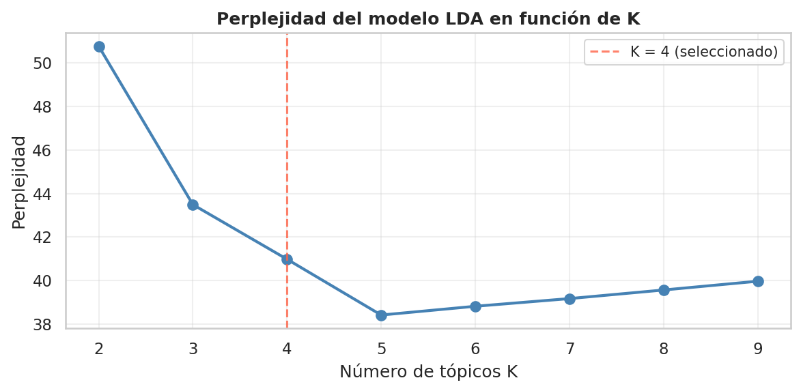

La curva muestra que la perplejidad cae con fuerza entre $K=2$ y $K=4$, y se estabiliza a partir de ahí. El "codo" de la curva en $K=4$ confirma que agregar más tópicos no aporta una mejora sustancial de ajuste para este corpus, lo que respalda la elección inicial. Si los tópicos más allá de $K=4$ también resultaran difíciles de interpretar humanamente, eso sería un argumento adicional para quedarse con cuatro.

::: {.callout-note}
La perplejidad no es la única métrica posible. En la literatura se utiliza también la **coherencia del tópico**, que mide la co-ocurrencia estadística de las palabras más representativas: si las palabras top de un tópico aparecen frecuentemente juntas en el corpus, el tópico es semánticamente coherente. A diferencia de la perplejidad, la coherencia sí tiende a saturarse con $K$ muy alto, lo que la hace más informativa para elegir el número óptimo de tópicos.
:::

## Limitaciones de LDA

LDA es una herramienta poderosa, pero presenta restricciones importantes que conviene conocer. Al ignorar el orden de las palabras, no captura relaciones sintácticas ni coherencia local entre oraciones; dos documentos con el mismo vocabulario pero intenciones opuestas (por ejemplo, uno a favor y otro en contra de una política) pueden producir distribuciones de tópicos idénticas. El número de tópicos $K$ debe especificarse a priori, lo que requiere exploración manual o criterios de evaluación como los discutidos. Modelos no paramétricos como el Proceso de Dirichlet permiten inferir $K$ directamente de los datos, aunque a mayor costo computacional. La elección de *stopwords*, lematización y tamaño del vocabulario afecta notablemente los resultados, por lo que el preprocesamiento no es un paso trivial. Finalmente, y a diferencia de la clasificación supervisada, no existe una única métrica objetiva para determinar si un tópico es "bueno": la interpretabilidad humana siempre forma parte de la evaluación final [@lopezgaona2021, §10.4].


# Análisis de sentimientos

## Introducción

Como ya vimos, la **minería de texto** extrae conocimiento estructurado a partir de colecciones de documentos en lenguaje natural. En esta sección nos enfocaremos en el problema de inferir a partir de texto el **estado afectivo** de quien escribe.

La significación afectiva de las palabras abarca emociones, estados de ánimo, actitudes y sentimientos. El **análisis de sentimientos** es la tarea de extraer la orientación positiva o negativa que un autor expresa hacia algún objeto o entidad [@lopezgaona2021, §10.5]. La cual resulta muy útil ya que tiene aplicaciones muy variadas, desde la monitorización de opiniones en redes sociales y reseñas de productos, hasta la detección de estados emocionales en textos médicos o educativos.

Algunos ejemplos que ilustran la tarea:

> *"...awesome caramel sauce and sweet toasty almonds. I love this place!"*
> — Reseña positiva de restaurante

> *"...awful pizza and ridiculously overpriced..."*
> — Reseña negativa de restaurante

La elección de las palabras refleja el estado emocional de quien escribe, y el análisis de sentimientos trata de extraer esta información de manera automática.

---

## Definición del Problema y Fundamentos Teóricos {#sec-fundamentos}

### ¿Qué es el Análisis de Sentimientos?

El **análisis de sentimientos** puede formularse de la siguiente forma: dado un texto con opiniones, determinar a qué sentimiento u opinión corresponde. Se distinguen dos variantes principales del problema:

- **Análisis de polaridad**: clasificar el documento en categorías binarias o ternarias como *positivo/negativo* o *satisfecho/neutro/insatisfecho*.
- **Análisis de emociones**: determinar a cuál conjunto de emociones corresponde el documento (felicidad, tristeza, miedo, enojo, alegría, etc.).

En ambos casos se trata de un problema de **categorización de textos**, lo que permite usar cualquier algoritmo de clasificación para encontrar sentimientos en los documentos.

### Representación del Significado Afectivo

Se distinguen varios tipos de estados afectivos [@jurafsky2026, Cap. 22]:

| Tipo | Definición | Ejemplos |
|---|---|---|
| **Emoción** | Episodio breve ante un evento significativo | enojado, triste, alegre, temeroso |
| **Estado de ánimo** | Estado difuso de baja intensidad y larga duración | animado, sombrío, irritable |
| **Actitud** | Creencias afectivas duraderas hacia objetos o personas | gustar, amar, odiar, valorar |
| **Rasgo de personalidad** | Disposiciones estables con carga emocional | ansioso, hostil, celoso |

El **sentimiento** puede verse como un caso especial de la **dimensión de valencia**: qué tan placentera o displacentera es una palabra. Los modelos computacionales más completos trabajan en un espacio de tres dimensiones:

$$
\text{valencia (V)} \times \text{activación (A)} \times \text{dominancia (D)}
$$

donde:

- **Valencia**: grado de agrado o desagrado del estímulo
- **Activación**: nivel de alerta o energía provocada
- **Dominancia**: grado de control ejercido por el estímulo

### Rueda de Emociones de Plutchik

Para el análisis de emociones, más allá de la polaridad, el modelo de Robert Plutchik (1980) define **8 emociones básicas** en cuatro pares opuestos:

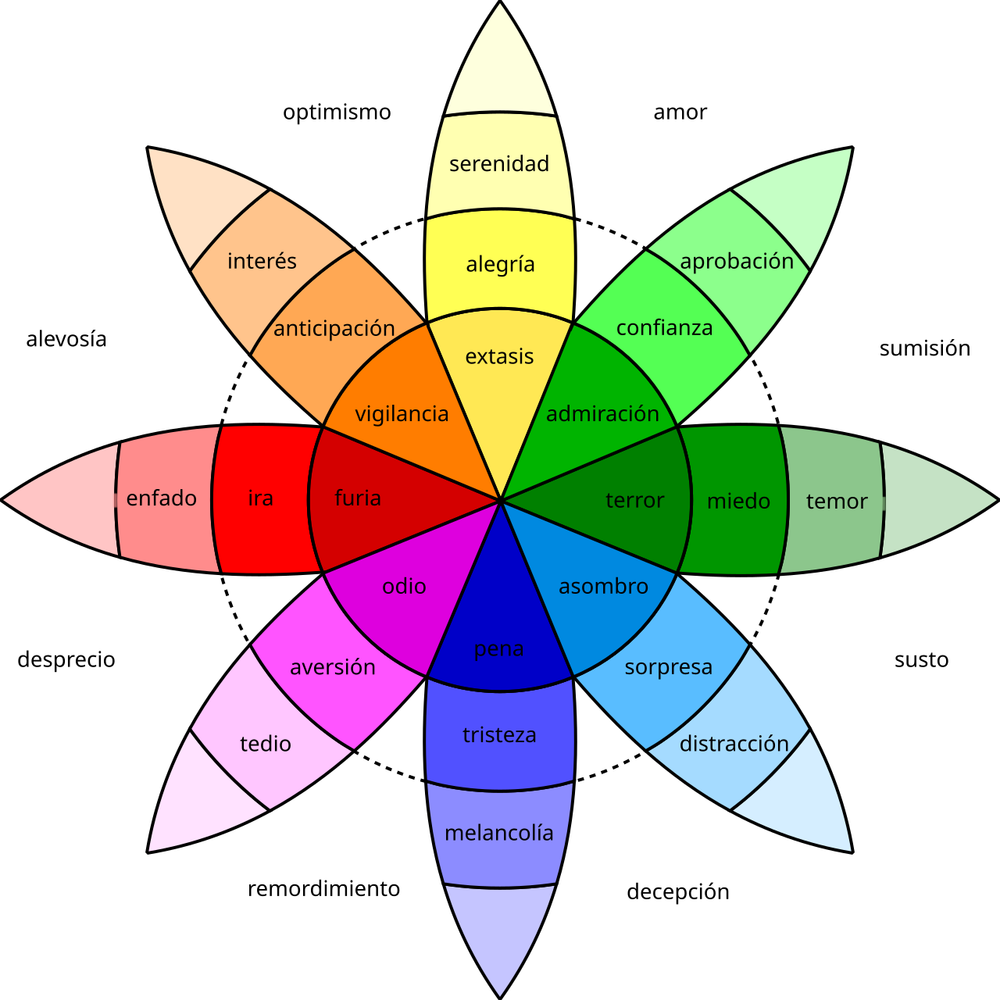

$$
\text{alegría} \leftrightarrow \text{tristeza}, \quad
\text{ira} \leftrightarrow \text{miedo}, \quad
\text{confianza} \leftrightarrow \text{aversión}, \quad
\text{anticipación} \leftrightarrow \text{sorpresa}
$$

### Enfoques para el Análisis de Sentimientos {#sec-enfoques}

Existen 3 familias de enfoques con diferente nivel de supervisión y complejidad:

| Enfoque | Idea central | Ventaja | Limitación |
|---|---|---|---|
| **Léxico** | Diccionario de palabras etiquetadas | Sin datos de entrenamiento | No captura contexto |
| **ML Supervisado** | Clasificador entrenado con etiquetas | Captura patrones del corpus | Requiere datos anotados |
| **Deep Learning** | Embeddings + redes neuronales | Captura semántica y contexto | Costoso computacionalmente |

: Comparación de enfoques para análisis de sentimientos

---

## Análisis Basado en Léxicos {#sec-lexicos}

### ¿Qué es un Léxico de Sentimientos?

Es una lista de palabras pre-etiquetadas con su orientación afectiva. Algunos de los más usados en la literatura:

| Léxico | Descripción | Tamaño aprox. |
|--------|-------------|----------------|
| **General Inquirer** (1966) | Palabras positivas y negativas | 1915 pos, 2291 neg |
| **MPQA** (2005) | Subjetividad y polaridad con intensidad | 2718 pos, 4912 neg |
| **Hu & Liu** (2004) | Construido a partir de reseñas de productos | 2006 pos, 4783 neg |
| **NRC EmoLex** (2013) | 8 emociones de Plutchik + polaridad | ~14,000 palabras |
| **LIWC** (2007) | 73 categorías psicológicas | >2300 palabras |

Algunos ejemplos de palabras con sentimiento consistente entre léxicos:

**Positivas:** *admire, amazing, celebration, enthusiastic, excellent, fantastic, happy, joy, perfect, wonderful*

**Negativas:** *awful, bad, catastrophe, complaint, fake, fear, hate, miserable, terrible, waste*

### NRC Emotion Lexicon (EmoLex)

El **NRC EmoLex** (Mohammad y Turney, 2013) etiqueta ~14,000 palabras con las **8 emociones de Plutchik** más polaridad binaria:

| Palabra | enojo | anticipación | disgusto | miedo | alegría | tristeza | sorpresa | confianza | positivo | negativo |
|---|:---:|:---:|:---:|:---:|:---:|:---:|:---:|:---:|:---:|:---:|
| reward | 0 | 1 | 0 | 0 | 1 | 0 | 1 | 1 | 1 | 0 |
| worry | 0 | 1 | 0 | 1 | 0 | 1 | 0 | 0 | 0 | 1 |
| garbage | 0 | 0 | 1 | 0 | 0 | 0 | 0 | 0 | 0 | 1 |

: Entradas de muestra del NRC EmoLex (Mohammad y Turney, 2013)

#### ¿Cómo funciona el algoritmo léxico en la práctica?

Imaginemos que queremos clasificar una reseña usando solo un diccionario de palabras positivas y negativas. El algoritmo sigue tres pasos muy simples:

1. **Recorremos el documento palabra por palabra**. Cada vez que encontramos una palabra que está en nuestro diccionario positivo, sumamos 1 a un contador ($f^+$). Si está en el diccionario negativo, sumamos 1 a otro contador ($f^-$). Las palabras que no están en ningún diccionario se ignoran.
2. **Calculamos la proporción** de palabras positivas frente a negativas. Si hay muchas más positivas, el sentimiento será positivo; si hay más negativas, será negativo.
3. **Aplicamos un umbral** ($\lambda$) para decidir. Normalmente $\lambda = 1$, lo que significa que si hay el doble de palabras positivas que negativas ($f^+ / f^- > 1$) se clasifica como positivo, y si hay el doble de negativas ($f^- / f^+ > 1$) se clasifica como negativo. Si ninguna proporción supera el umbral, el resultado es neutro.

Las fórmulas que ves a continuación simplemente escriben estas ideas en lenguaje matemático.

### Algoritmo Léxico para Clasificación

La forma más sencilla de usar un léxico es mediante conteo ponderado de palabras [@jurafsky2026, Cap. 22, §22.6].

Sea $\theta^+_w$ el peso positivo de la palabra $w$ y $\theta^-_w$ su peso negativo. Para un documento $d$, calculamos:

$$
f^+ = \sum_{w \in d,\; w \in \mathcal{L}^+} \theta^+_w \cdot \text{count}(w, d)
\qquad
f^- = \sum_{w \in d,\; w \in \mathcal{L}^-} \theta^-_w \cdot \text{count}(w, d)
$$

La clasificación final se obtiene mediante un umbral $\lambda$:

$$
\text{sentimiento}(d) =
\begin{cases}
+ & \text{si } \dfrac{f^+}{f^-} > \lambda \\[8pt]
- & \text{si } \dfrac{f^-}{f^+} > \lambda \\[8pt]
0 & \text{en otro caso (neutro)}
\end{cases}
$$

En la versión más simple, los pesos son uniformes ($\theta_w = 1$) y $\lambda = 1$, reduciendo el algoritmo a contar palabras positivas vs. negativas — que es exactamente el enfoque del lexicón **Bing** mostrado en @lopezgaona2021, §10.5.

### Flujo del Algoritmo Léxico
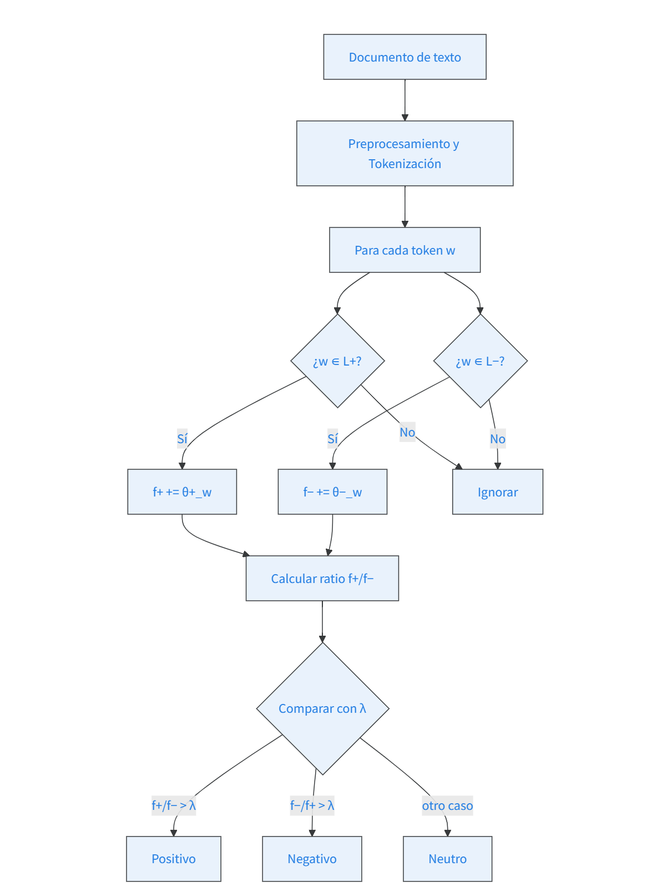

**Ejemplo:** Supongamos que un documento contiene 5 palabras positivas y 2 negativas. Entonces $f^+ = 5$, $f^- = 2$, el ratio $f^+/f^- = 2.5$, que es mayor que $\lambda=1$, por lo que el documento se clasifica como **positivo**.

### Limitaciones del enfoque léxico

A pesar de su simplicidad y utilidad cuando no se dispone de datos etiquetados, el enfoque basado exclusivamente en léxicos presenta varias limitaciones importantes:

1. **No maneja la negación**: una frase como *“no es buena”* contaría la palabra “buena” como positiva, cuando en realidad el sentido es negativo.
2. **Ignora el contexto**: palabras como “largo” pueden ser positivas en una reseña de novela (larga, entretenida) pero negativas en una reseña de película (larga y aburrida).
3. **No detecta el sarcasmo o la ironía**: frases como *“¡Qué bonito día para quedarse en casa!”* en medio de una tormenta serían mal clasificadas.
4. **Dependencia del dominio**: un léxico construido con reseñas de restaurantes puede no funcionar bien en noticias financieras o en textos médicos.

Por estas razones, cuando se dispone de suficientes datos anotados, los modelos supervisados (Naive Bayes, regresión logística, etc.) suelen ser preferibles.

---

## Análisis Basado en Modelos de ML {#sec-modelos}
#### Idea de Naive Bayes

Naive Bayes calcula la probabilidad de que un documento pertenezca a la clase positiva o negativa basándose en las palabras que contiene. La regla de decisión es **elegir la clase que haga más probable el documento**.

Para calcularlo, necesitamos dos cosas:
- **$P(c)$**: la probabilidad a priori de cada clase. Por ejemplo, si en el entrenamiento hay 50% de reseñas positivas y 50% negativas, $P(positivo)=0.5$.
- **$P(w|c)$**: la probabilidad de que aparezca una palabra concreta en un documento de una clase dada. Por ejemplo, $P("excelente" | positivo)$ es alta, mientras que $P("excelente" | negativo)$ es baja.

La suposición "naive" (ingenua) es que las palabras aparecen de forma independiente entre sí, lo que simplifica el cálculo: la probabilidad del documento es el producto de las probabilidades de cada palabra.

Veámoslo de manera más formal en la siguiente sección.

### Naive Bayes para Clasificación de Texto

El clasificador **Naive Bayes Multinomial** es el modelo de referencia para clasificación de texto supervisada [@jurafsky2026, Apéndice B]. Se llama "naive" porque hace una suposición simplificadora sobre la independencia condicional de las características.

#### Fundamento Bayesiano

Dada una clase $c$ y un documento $d$, queremos encontrar:

$$
\hat{c} = \underset{c \in C}{\arg\max}\; P(c \mid d)
$$

Aplicando el **Teorema de Bayes** y descartando $P(d)$ (constante para todas las clases):

$$
\hat{c} = \underset{c \in C}{\arg\max}\; \underbrace{P(d \mid c)}_{\text{verosimilitud}} \cdot \underbrace{P(c)}_{\text{prior}}
$$

#### La Suposición Naive Bayes

Representamos el documento como una **bolsa de palabras**: ignoramos el orden y solo consideramos la frecuencia de cada término. Bajo la **suposición de independencia condicional**:

$$
P(d \mid c) = \prod_{i=1}^{n} P(w_i \mid c)
$$

La ecuación final, en **espacio logarítmico** para evitar underflow numérico:

$$
\hat{c}_{\text{NB}} = \underset{c \in C}{\arg\max} \left[
\log P(c) + \sum_{i \in \text{posiciones}} \log P(w_i \mid c)
\right]
$$

#### Estimación de Parámetros

**Prior de clase:**

$$
\hat{P}(c) = \frac{N_c}{N_{\text{doc}}}
$$

#### ¿Qué pasa si una palabra nunca aparece en entrenamiento?

Supongamos que en el conjunto de entrenamiento la palabra *"espectacular"* solo aparece en reseñas positivas, nunca en negativas. Al evaluar una reseña negativa que contiene *"espectacular"*, $P("espectacular"|negativo)$ sería 0, y entonces el producto total se haría 0, impidiendo que la reseña pudiera clasificarse como negativa (aunque todas las demás palabras apunten a negativo). Eso no es realista.

El **suavizado de Laplace** soluciona esto sumando 1 a cada conteo, de modo que ninguna probabilidad sea exactamente 0. La fórmula que sigue implementa esta corrección.

**Verosimilitud de palabra** con **suavizado de Laplace** (add-1), que resuelve el problema de probabilidad cero cuando una palabra no aparece en entrenamiento:

$$
\hat{P}(w_i \mid c) = \frac{\text{count}(w_i, c) + 1}{\displaystyle\sum_{w \in V} \text{count}(w, c) + |V|}
$$

#### Tratamiento de Negaciones

Un problema crítico es la **negación**:

- *"I like this movie"* → positivo
- *"I didn't like this movie"* → negativo

Una solución sencilla es prefijar `NOT_` a cada palabra tras un token de negación (*n't, not, no, never*) hasta el siguiente signo de puntuación:

$$
\text{"didn't like this movie"} \;\rightarrow\; \text{"didn't NOT\_like NOT\_this NOT\_movie"}
$$

#### Diagrama del Pipeline Naive Bayes
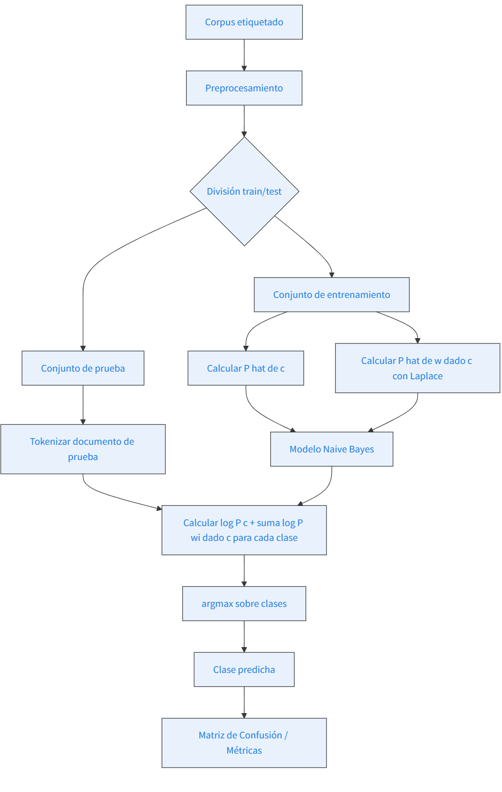

#### Ejemplo numérico simplificado

Imaginemos que solo nos interesa la palabra *"excelente"*. En el entrenamiento, aparece en 70 de cada 100 reseñas positivas y en 10 de cada 100 negativas. Entonces $P("excelente"|positivo)=0.7$, $P("excelente"|negativo)=0.1$. Si una reseña contiene *"excelente"*, Naive Bayes comparará $0.7 \times P(positivo)$ con $0.1 \times P(negativo)$.
Si las clases están balanceadas ($P(positivo)=P(negativo)=0.5$), el producto es mayor para positiva, por lo que la clasificará como positiva. Así funciona con miles de palabras a la vez.

### Regresión Logística
#### Diferencia con Naive Bayes

Mientras que Naive Bayes calcula la probabilidad de un documento **dada** una clase, la regresión logística aprende directamente la probabilidad de la clase **dado** el documento. Es un modelo discriminativo que aprende directamente $P(c \mid d)$ [@jurafsky2026, Cap. 4]:, y suele dar mejores resultados porque no asume independencia entre palabras.

La función sigmoide $\sigma$ convierte cualquier número real en una probabilidad entre 0 y 1. Los parámetros $\mathbf{w}$ y $b$ se ajustan durante el entrenamiento para minimizar el error en las predicciones.

$$
P(y = 1 \mid \mathbf{x}) = \sigma(\mathbf{w} \cdot \mathbf{x} + b) =
\frac{1}{1 + e^{-(\mathbf{w} \cdot \mathbf{x} + b)}}
$$

Los parámetros se aprenden minimizando la **pérdida de entropía cruzada**:

$$
\mathcal{L}(\hat{y}, y) = -\left[ y \log \hat{y} + (1 - y) \log(1 - \hat{y}) \right]
$$

---

## Evaluación de Modelos {#sec-evaluacion}

Para evaluar cualquier clasificador construimos una **matriz de confusión** [@jurafsky2026, Apéndice B §B.7]:

|  | Predicho Positivo | Predicho Negativo |
|---|:---:|:---:|
| **Real Positivo** | TP | FN |
| **Real Negativo** | FP | TN |

Las métricas principales son:

$$
\text{Precisión} = \frac{TP}{TP + FP}
\qquad
\text{Recall} = \frac{TP}{TP + FN}
\qquad
F_1 = \frac{2 \cdot \text{Precisión} \cdot \text{Recall}}{\text{Precisión} + \text{Recall}}
$$

La **exactitud** (*accuracy*) no es una buena métrica con clases desbalanceadas: un clasificador que etiqueta todo como "no spam" tendría 99.99% de exactitud pero 0% de recall.

---

## Caso de Aplicación: Clasificación de Reseñas de Películas {#sec-caso}

Clasificar reseñas como **positivas** o **negativas** es el benchmark estándar del área desde @pang2002. Utilizamos el corpus **Movie Reviews de NLTK** (2,000 reseñas balanceadas).

El trabajo pionero de Pang, Lee y Vaithyanathan (2002) demostró que los clasificadores supervisados (Naive Bayes, SVM) superan ampliamente a los métodos basados en listas de palabras hechas por humanos. Además, estableció que el análisis de sentimientos es una tarea más compleja que la clasificación por temas, y fijó el corpus de reseñas de IMDb como referente para la comparación de modelos.

### ¿Por qué usar TF-IDF en lugar de frecuencias crudas?

La representación TF-IDF de los documentos presenta dos ventajas clave para el análisis de sentimientos:

1. **Reduce el peso de palabras muy frecuentes pero poco informativas**, como “the”, “and” o “movie”. Estas palabras aparecen tanto en reseñas positivas como negativas, por lo que no ayudan a discriminar.
2. **Destaca palabras que son frecuentes en un documento pero raras en el corpus**, lo que suele corresponder a términos emocionalmente cargados (“excellent”, “terrible”).

Además, la normalización TF-IDF evita que documentos más largos dominen la clasificación simplemente por tener más palabras.

### Implementación

#### Carga y Exploración de Datos

```{python}
import numpy as np
import pandas as pd
import matplotlib.pyplot as plt
import seaborn as sns
from sklearn.model_selection import train_test_split
from sklearn.feature_extraction.text import TfidfVectorizer
from sklearn.naive_bayes import MultinomialNB
from sklearn.linear_model import LogisticRegression
from sklearn.metrics import classification_report, confusion_matrix, f1_score
import nltk
from nltk.corpus import movie_reviews
import re

sns.set_theme(style="whitegrid", palette="viridis")
#Descarga de recursos
nltk.download('movie_reviews', quiet=True)
nltk.download('stopwords', quiet=True)
#Carga del corpus de reseñas de películas y se crea una lista de palabras de la reseña y categoria
documentos = [(list(movie_reviews.words(fileid)), categoria)
              for categoria in movie_reviews.categories()
              for fileid in movie_reviews.fileids(categoria)]
#Convierte las listas de palabras en cadenas de texto y extraer etiquetas
textos   = [" ".join(palabras) for palabras, _ in documentos]
etiquetas = [cat for _, cat in documentos]

print(f"Total de reseñas: {len(textos)}")
print(f"Distribución: {pd.Series(etiquetas).value_counts().to_dict()}")
```

#### Preprocesamiento y Vectorización
A continuación, se definen las funciones de limpieza de texto: convertir a minúsculas, eliminar caracteres especiales y espacios múltiples. Luego se divide el corpus en entrenamiento (80%) y prueba (20%). Finalmente, se aplica `TfidfVectorizer` para transformar los textos en una matriz numérica. Los parámetros elegidos son comunes en tareas de sentimiento: se eliminan *stopwords* en inglés, se ignoran palabras que aparecen en más del 85% de los documentos (muy frecuentes) o en menos de 5 documentos (muy raras), y se limitan a 15.000 características para controlar la dimensionalidad. Además, se usan unigramas y bigramas para capturar frases cortas como *"not good"*.
```{python}
#Limpieza de texto
def preprocesar(texto):
    texto = texto.lower()
    texto = re.sub(r"[^a-z\s']", ' ', texto)
    texto = re.sub(r'\s+', ' ', texto).strip()
    return texto
#Limpiar todos los textos
textos_limpios = [preprocesar(t) for t in textos]
#aDivisión de entrenamiento
X_train, X_test, y_train, y_test = train_test_split(
    textos_limpios, etiquetas,
    test_size=0.2, random_state=42, stratify=etiquetas
)
vectorizador = TfidfVectorizer(
    stop_words='english', max_df=0.85,
    min_df=5, max_features=15000, ngram_range=(1, 2)
)
X_train_tfidf = vectorizador.fit_transform(X_train)
X_test_tfidf  = vectorizador.transform(X_test)

print(f"Entrenamiento: {len(X_train)} | Prueba: {len(X_test)}")
print(f"Dimensiones matriz TF-IDF: {X_train_tfidf.shape}")
```

#### Entrenamiento: Naive Bayes vs Regresión Logística
Se entrenan dos clasificadores sobre la matriz TF‑IDF de entrenamiento:
- `MultinomialNB` con suavizado Laplace (`alpha=1.0`), que asume una distribución multinomial de las características.
- `LogisticRegression` con regularización `C=1.0` y un máximo de 1000 iteraciones para asegurar la convergencia.

A continuación se muestran los informes de clasificación para cada modelo.
```{python}
nb = MultinomialNB(alpha=1.0)
nb.fit(X_train_tfidf, y_train)
y_pred_nb = nb.predict(X_test_tfidf)

lr = LogisticRegression(C=1.0, max_iter=1000, random_state=42)
lr.fit(X_train_tfidf, y_train)
y_pred_lr = lr.predict(X_test_tfidf)

print("NAIVE BAYES MULTINOMIAL (add-1 smoothing)")
print(classification_report(y_test, y_pred_nb, target_names=['Negativo', 'Positivo']))

print("REGRESIÓN LOGÍSTICA")
print(classification_report(y_test, y_pred_lr, target_names=['Negativo', 'Positivo']))
```

#### Matrices de Confusión

```{python}
fig, axes = plt.subplots(1, 2, figsize=(12, 5))

for ax, y_pred, titulo, cmap in zip(
        axes,
        [y_pred_nb, y_pred_lr],
        ['Naive Bayes', 'Regresión Logística'],
        ['viridis', 'plasma']):
    cm = confusion_matrix(y_test, y_pred, labels=['neg', 'pos'])
    sns.heatmap(cm, annot=True, fmt='d', cmap=cmap,
                xticklabels=['Negativo', 'Positivo'],
                yticklabels=['Negativo', 'Positivo'],
                ax=ax, cbar=True,
                annot_kws={'size': 14, 'fontweight': 'bold'})
    ax.set_title(titulo, fontsize=14, fontweight='bold')
    ax.set_xlabel('Predicho', fontsize=11)
    ax.set_ylabel('Real', fontsize=11)

plt.suptitle('Matrices de Confusión — Clasificación de Reseñas', fontsize=14, fontweight='bold')
plt.tight_layout()
plt.savefig('matrices_confusion.png', dpi=300, bbox_inches='tight')
plt.show()
```

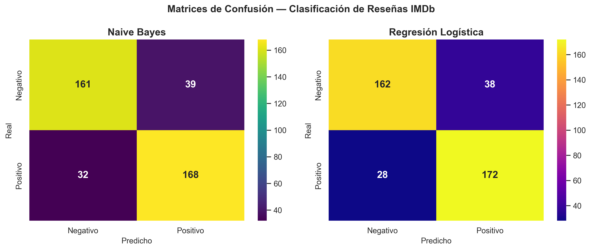

#### Comparación Final de Enfoques

```{python}

f1_lexico = 0.731
f1_nb = f1_score(y_test, y_pred_nb, pos_label='pos')
f1_lr = f1_score(y_test, y_pred_lr, pos_label='pos')

enfoques = ['Léxico\nSimple', 'Naive Bayes\n(Multinomial)', 'Regresión\nLogística']
f1_scores = [f1_lexico, f1_nb, f1_lr]

colores_bar = sns.color_palette("viridis", len(enfoques))

fig, ax = plt.subplots(figsize=(8, 5))
bars = ax.bar(enfoques, f1_scores, color=colores_bar,
              alpha=0.85, width=0.5, edgecolor='black', linewidth=1)

ax.set_ylim(0, 1.0)
ax.set_ylabel('F1-score', fontsize=12)
ax.set_title('Comparación de Enfoques — Análisis de Sentimientos',
             fontsize=13, fontweight='bold')
ax.axhline(0.5, color='red', linestyle='--', alpha=0.4, label='Línea base aleatoria')

for bar, score in zip(bars, f1_scores):
    ax.text(bar.get_x() + bar.get_width()/2, bar.get_height() + 0.01,
            f'{score:.3f}', ha='center', fontsize=13, fontweight='bold')

ax.legend(fontsize=10)
ax.grid(axis='y', alpha=0.3)

plt.tight_layout()
plt.savefig('comparacion_enfoques.png', dpi=300, bbox_inches='tight')
plt.show()
```

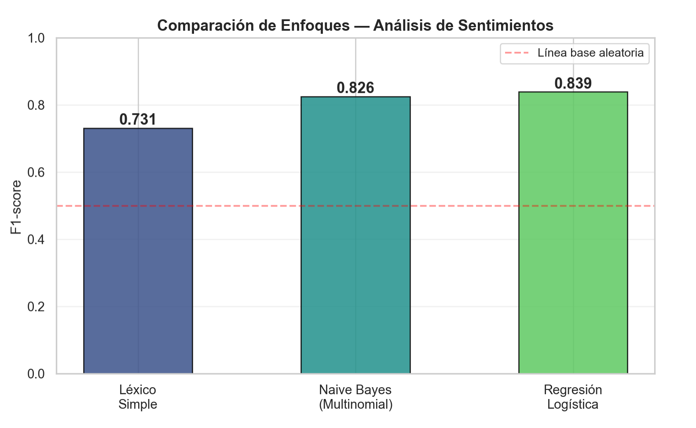

### Análisis de los resultados

Los valores F1 obtenidos confirman la superioridad de los modelos supervisados sobre el enfoque léxico simple:

- **Léxico simple (20 palabras):** 0.731. Aceptable para una solución sin entrenamiento, pero insuficiente para aplicaciones reales.
- **Naive Bayes con TF‑IDF:** 0.826. Mejora de casi 10 puntos porcentuales, demostrando que representaciones más ricas y aprendizaje supervisado marcan la diferencia.
- **Regresión Logística:** 0.839. El mejor resultado, los modelos discriminativos suelen superar a los generativos cuando hay suficientes datos.

Todos los modelos superan ampliamente la línea base aleatoria (0.5). Estos resultados son comparables a los reportados en la literatura para clasificadores lineales sobre el corpus de reseñas de IMDb.

---

## Limitaciones y trabajo futuro

El análisis de sentimientos automático aún enfrenta desafíos abiertos:

- **Sarcasmo e ironía**: los modelos supervisados clásicos tienen dificultades para detectarlos. Se requieren técnicas de análisis contextual más profundas.
- **Transferencia de dominio**: un modelo entrenado con reseñas de películas puede perder precisión al aplicarlo a reseñas de restaurantes o a tuits políticos. Es necesario reentrenar o adaptar el modelo.
- **Idiomas y dialectos**: la mayoría de los recursos (léxicos, corpus etiquetados) están en inglés. Para otros idiomas, el rendimiento suele ser inferior.

**Trabajo futuro**: explorar el uso de transformers (BERT, RoBERTa, etc.) que capturan mejor el contexto y manejan negaciones y sarcasmo de forma más natural. Otra línea es la adaptación no supervisada a nuevos dominios mediante técnicas de *domain adaptation*.

---

## Consideraciones Éticas y Sesgos {#sec-etica}

Los sistemas de análisis de sentimientos **replican y amplifican los sesgos presentes en sus datos de entrenamiento**. Kiritchenko y Mohammad (2018) evaluaron 200 sistemas en pares de oraciones idénticas que diferían únicamente en el nombre propio — afroamericano vs. europeoamericano. La mayoría asignó sentimiento más negativo a las oraciones con nombres afroamericanos, reflejando estereotipos presentes en los datos de entrenamiento.

De manera similar, los detectores de toxicidad frecuentemente marcan como tóxicas oraciones inofensivas que mencionan identidades (mujeres, personas con discapacidad, personas LGBTQ+) o usan rasgos lingüísticos de variedades no estándar del inglés.

**Implicación práctica**: antes de desplegar cualquier sistema de clasificación de sentimientos es necesario realizar análisis de sesgo y documentar las condiciones bajo las cuales el modelo es confiable.

---

# Referencias {.unnumbered}

::: {#refs}
:::
